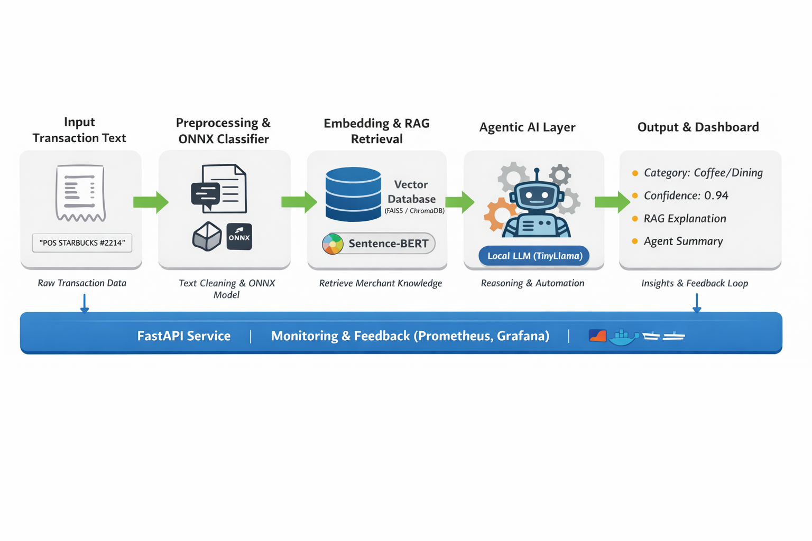

# TransacMind

This repository contains a fully-local, end-to-end transaction categorisation system designed for experimentation and deployment on a single machine. It provides:
# 🌊 Data Flow Diagram

The core logic resides within the FastAPI server. Here is a detailed breakdown of how data flows through the AI services during a user session.




- A FastAPI inference service exposing `/predict` for transaction classification and explanations.
- Local embeddings (Sentence-BERT / stub fallback), an ONNX classifier (with quantized model fallback), a local RAG engine (ChromaDB optional, local NPZ + NearestNeighbors fallback), and a lightweight agent controller that can use LangChain/llama when available or fallback to summarizers.
- SHAP explainability support, Streamlit feedback & XAI dashboard, Prometheus metrics, Grafana dashboard JSON, and Locust load test scenarios.
- Training/export helpers to produce an ONNX model (and attempt quantization) and a script to build a local RAG store from the taxonomy.

This README explains how the project works and gives step-by-step commands to run it locally on Windows (PowerShell). All commands are separated and copy-paste ready.

**Project Workflow**

- **Preprocess**: `api/inference/preprocess.py` normalizes input text.
- **Embed**: `api/inference/embedder.py` produces embeddings using `sentence-transformers` when installed, otherwise it uses a deterministic stub.
- **Classify**: `api/inference/classifier.py` runs an ONNX model (or stub) to return a category and confidence.
- **RAG**: `api/rag/rag_engine.py` returns nearest example rationales. It prefers ChromaDB but will load `api/rag/local_store.npz` and use sklearn `NearestNeighbors` if Chroma or FAISS aren't available.
- **Agent**: `api/agents/agent_controller.py` will try to initialize a LangChain agent and local LLM; if unavailable, it provides a concise textual summary of the prediction + rationale.
- **Explain**: `classifier.shap_explain` returns a small SHAP-style vector (guarded if SHAP isn't installed or is too slow).

**Where to look (key paths)**

- API: `api/main.py`
- Inference: `api/inference/` (embedder, classifier, preprocess)
- RAG: `api/rag/` (build and engine)
- Agents: `api/agents/`
- Models & taxonomy: `api/models/` (includes `taxonomy.json` and exported `model.onnx` placeholder)
- Training & export: `training/export_to_onnx.py`

## TransacMind

This repository contains a fully-local, end-to-end transaction categorisation system designed for experimentation and deployment on a single machine. It provides:

- A FastAPI inference service exposing `/predict` for transaction classification and explanations.
- Local embeddings (Sentence-BERT / stub fallback), an ONNX classifier (with quantized model fallback), a local RAG engine (ChromaDB optional, local NPZ + NearestNeighbors fallback), and a lightweight agent controller that can use LangChain/llama when available or fallback to summarizers.
- SHAP explainability support, Streamlit feedback & XAI dashboard, Prometheus metrics, Grafana dashboard JSON, and Locust load test scenarios.
- Training/export helpers to produce an ONNX model (and attempt quantization) and a script to build a local RAG store from the taxonomy.

This README explains how the project works and gives step-by-step commands to run it locally on Windows (PowerShell). All commands are separated and copy-paste ready.

### Project workflow

- **Preprocess**: `api/inference/preprocess.py` normalizes input text.
- **Embed**: `api/inference/embedder.py` produces embeddings using `sentence-transformers` when installed, otherwise it uses a deterministic stub.
- **Classify**: `api/inference/classifier.py` runs an ONNX model (or stub) to return a category and confidence.
- **RAG**: `api/rag/rag_engine.py` returns nearest example rationales. It prefers ChromaDB but will load `api/rag/local_store.npz` and use sklearn `NearestNeighbors` if Chroma or FAISS aren't available.
- **Agent**: `api/agents/agent_controller.py` will try to initialize a LangChain agent and local LLM; if unavailable, it provides a concise textual summary of the prediction + rationale.
- **Explain**: `classifier.shap_explain` returns a small SHAP-style vector (guarded if SHAP isn't installed or is too slow).

### Where to look (key paths)

- API: `api/main.py`
- Inference: `api/inference/` (embedder, classifier, preprocess)
- RAG: `api/rag/` (build and engine)
- Agents: `api/agents/`
- Models & taxonomy: `api/models/` (includes `taxonomy.json` and exported `model.onnx` placeholder)
- Training & export: `training/export_to_onnx.py`
- Smoke tests: `tests/` and helper scripts in `scripts/`

### Quick prerequisites (recommended)

- Python 3.10+ (the code was developed on 3.10)
- On Windows, use PowerShell and a virtual environment.
- Install minimal dependencies first (`requirements-core.txt`) to bootstrap the server and run smoke tests. Install `requirements-full.txt` if you want the full feature set (Streamlit, chromadb, langchain, SHAP, etc.).

### Step-by-step: Local run (PowerShell)

1. Open PowerShell and change to the project directory:

```powershell
Set-Location -Path "F:\\TransacMind\\transactmind"
```

2. Create a virtual environment (one-time):

```powershell
python -m venv .venv
```

3. Activate the venv:

```powershell
. .venv\\Scripts\\Activate.ps1
```

4. Install core dependencies (small set to start the service):

```powershell
pip install -r requirements-core.txt
```

5. (Optional) Install full dependencies for RAG/LLM/Streamlit/SHAP:

```powershell
pip install -r requirements-full.txt
```

6. (Optional) Train and export a tiny ONNX model (demo dataset) — this writes `api/models/model.onnx` and a quantized version when possible:

```powershell
python .\\training\\export_to_onnx.py
```

7. Build the local RAG store (if you want the local NPZ fallback filled from `api/models/taxonomy.json`):

```powershell
python .\\api\\rag\\build_rag_db.py
```

This will attempt to use ChromaDB. If unavailable it creates `api/rag/local_store.npz` using the embedder (or a deterministic fallback).

8. Start the FastAPI server (development):

```powershell
# From repo root
python -m uvicorn api.main:app --host 0.0.0.0 --port 8000
```

Note: The server listens on `0.0.0.0` (all interfaces). Use `http://127.0.0.1:8000/` or `http://localhost:8000/docs` in a browser. If accessing from another machine, use the host's LAN IP and ensure the firewall allows inbound traffic on `8000`.

9. Run the local smoke test (calls the running app):

```powershell
# Quick helper script
python .\\scripts\\run_predict_local.py
```

10. Example manual POST (PowerShell):

```powershell
Invoke-RestMethod -Uri "http://127.0.0.1:8000/predict" -Method POST -ContentType "application/json" -Body '{"transaction_text":"buy milk from supermarket"}'
```

11. If you want to run the pytest smoke-test that imports the real app, run:

```powershell
# from repo root
pytest -q tests/smoke_test_real.py
```

12. Run the Streamlit feedback / XAI UI (optional):

```powershell
streamlit run dashboard/feedback_ui.py
# or
streamlit run dashboard/xai_dashboard.py
```

13. Start services with Docker Compose (optional, when using dockerized Chromadb/Prometheus/Grafana):

```powershell
cd docker
docker-compose up --build
```

14. Run Locust load tests (optional):

```powershell
locust -f locustfile.py --host=http://127.0.0.1:8000
```

### API `/predict`: payload & response

**Request JSON (required field name):**

```json
{"transaction_text": "buy milk from supermarket"}
```

**Example response (JSON):**

```json
{
 "category": "groceries",
 "confidence": 0.95,
 "rag_explanation": "Example: 'Walmart Supercenter 1234' ...",
 "agent_summary": "Predicted 'groceries' with confidence 0.95 ...",
 "shap": {"shap_values": [ ... ]}
}
```

### Troubleshooting & notes

- If you see errors about missing modules (chromadb, langchain, shap, sentence_transformers), install `requirements-full.txt` — these packages are optional and large on Windows.
- If ONNX runtime fails, check that `onnxruntime` is installed and the model file `api/models/model.onnx` exists. `training/export_to_onnx.py` creates an example model.
- If the app is running but `Invoke-RestMethod` fails, verify you are using `127.0.0.1` or `localhost` (not `0.0.0.0`) and that no firewall blocks the port.
- To stop the server running via `uvicorn` started in a terminal, press `CTRL+C` in that terminal or kill the `python` process.

### Design choices & why they matter

- Staged requirements (`requirements-core.txt` vs `requirements-full.txt`): allows quick boot and iterative install of heavy optional components.
- Local RAG fallback: avoids platform-specific FAISS/Chroma install issues — the code falls back to a simple NPZ-based store + sklearn `NearestNeighbors` for nearest-example explanations.
- Stub fallbacks for embedder/classifier/agent allow the API to start even with missing heavy libs; this is intentional for developer speed.

### Next steps & recommended workflow for development

- Install core deps, start the server, and run `scripts/run_predict_local.py` to verify the happy path quickly.
- Install `requirements-full.txt` when you want to use Chroma/LLM/SHAP/streamlit.
- If you want production readiness, containerize with the provided Dockerfiles and wire up persistent Chromadb/Prometheus/Grafana in `docker-compose.yml`.

If you want, I can also add a short `docs/QUICKSTART.md` with annotated screenshots and a developer checklist.

---

Project root: `F:\\TransacMind\\transactmind`

If anything doesn't work on your machine, paste the error and I'll patch the code or the README to make the steps clearer.

If anything doesn't work on your machine, paste the error and I'll patch the code or the README to make the steps clearer.

Quick start (PowerShell):

```powershell
Set-ExecutionPolicy -Scope Process -ExecutionPolicy Bypass -Force
.\scripts\setup_venv.ps1
# activate
.\.venv\Scripts\Activate.ps1
pip install -r requirements.txt
python .\training\export_to_onnx.py
python .\api\rag\build_rag_db.py
uvicorn api.main:app --host 0.0.0.0 --port 8000
```

See `BENCHMARKS.md` for performance notes.
